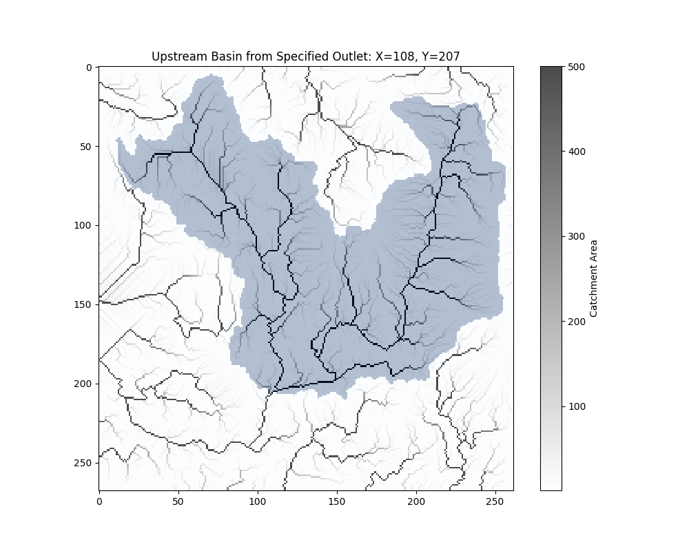

# User Guide for Analyzing Upstream Basin

This guide offers instructions for utilizing the tool to delineate upstream catchment areas from Digital Elevation Model (DEM) data. The tool visualizes catchment areas based on specified outlet points and identifies the nearest cell index using latitude and longitude coordinates.

## Requirements
To use the code, make sure you have installed the following Python packages:
- **numpy** (`pip install numpy`)
- **pysheds** (`pip install pysheds`)
- **matplotlib** (`pip install matplotlib`)
- **pyproj** (`pip install pyproj`)

## Function Overview

```python
analyze_upstream_basin(asc_file_path, col, row, threshold, xytype='index', target_crs=None, source_crs=None, clip_to=False)
```

The `analyze_upstream_basin` function calculates and visualizes the upstream catchment area using a DEM data file in ASCII format.

### Parameters
- **asc_file_path** (str): Path to the DEM ASCII file.
- **col** (int/float): Column coordinate or longitude value.
- **row** (int/float): Row coordinate or latitude value.
- **threshold** (int): Minimum flow accumulation threshold for identifying high-accumulation cells.
- **xytype** (str, optional): Type of coordinates used. Set to `'index'` for grid cell indices or `'coordinate'` for geographic coordinates. Default is `'index'`.
- **target_crs** (str, optional): EPSG code of the target coordinate reference system for transformation (e.g., "EPSG:32610"). Only applicable if **xytype** is set to `'coordinate'`.
- **source_crs** (str, optional): EPSG code of the source coordinate reference system (default is "EPSG:4326"). Only applicable if **xytype** is set to `'coordinate'`.
- **clip_to** (bool, optional): If set to `True`, the catchment area will be clipped for visualization.

### Output
The function displays a plot of the upstream catchment area. The plot includes a color-coded representation of the catchment with flow accumulation.

## Instructions

### 1. Initialize the Function
The function requires a DEM ASCII file path and coordinates for the outlet point. You have two options for specifying the coordinates:

#### Option 1: Using Grid Index Coordinates
Specify the outlet point using grid index coordinates (**col** and **row**).

```python
# Define the input parameters
asc_file_path = 'WA_Samish/Data_Inputs90m/m_1_DEM/Samish_DredgeMask_EEX.asc'
col, row = 108, 207
threshold = 500

# Call the function
analyze_upstream_basin(asc_file_path, col, row, threshold, xytype='index')
```

#### Option 2: Using Geographic Coordinates
Specify the outlet point using geographic coordinates (latitude and longitude) and transform them to the target CRS.

```python
# Define the input parameters
asc_file_path = 'WA_Samish/Data_Inputs90m/m_1_DEM/Samish_DredgeMask_EEX.asc'
lat, long = 48.54594127, -122.3382169
threshold = 500

# Call the function with coordinate transformation
target_crs = "EPSG:32610"
analyze_upstream_basin(asc_file_path, long, lat, threshold, xytype='coordinate', target_crs=target_crs)
```

### 2. Explanation of Processing Steps

1. **Initialize Grid and Read DEM**: The DEM data is read using PySheds.
2. **Fill Depressions and Resolve Flats**: Depressions in the DEM are filled, and flat areas are resolved to ensure proper flow direction calculations.
3. **Compute Flow Direction**: Flow direction is computed using the DEM.
4. **Extract Upstream Basin**:
   - If using **xytype = 'coordinate'**, the specified outlet point is snapped to the nearest high-accumulation cell, and coordinates are optionally transformed using the specified CRS.
   - If using **xytype = 'index'**, the outlet point is treated as a grid cell index.
5. **Visualize Catchment Area**: The catchment area is visualized along with flow accumulation data.

### 3. Visualization
The function will produce a plot displaying the upstream basin and flow accumulation values.

- **Blues Color Map**: Indicates the extent of the catchment area.
- **Binary Color Map**: Represents flow accumulation values greater than the specified threshold.

The visualization provides a clear indication of the upstream area that contributes to the specified outlet point.

## Example Outputs

The following images represent typical outputs from the function:

  
*Figure: Upstream Basin from Specified Outlet*

## Notes
- Ensure that the DEM ASCII file is accessible and correctly formatted.
- The **threshold** value affects the snapping process for geographic coordinates; a higher value will snap the outlet point to cells with greater flow accumulation.
- The coordinate transformation is performed using the PyProj library.

## Troubleshooting
- **FileNotFoundError**: Verify that the provided DEM file path is correct.
- **Coordinate Transformation Issues**: Ensure that the **target_crs** and **source_crs** values are valid EPSG codes.

## Additional Resources
- [PySheds Documentation](https://pysheds.readthedocs.io/)
- [PyProj Documentation](https://pyproj4.github.io/pyproj/)
- [Matplotlib Documentation](https://matplotlib.org/stable/contents.html)

Feel free to customize the parameters as needed to explore different areas of interest within your DEM data!

